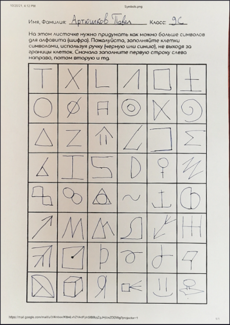
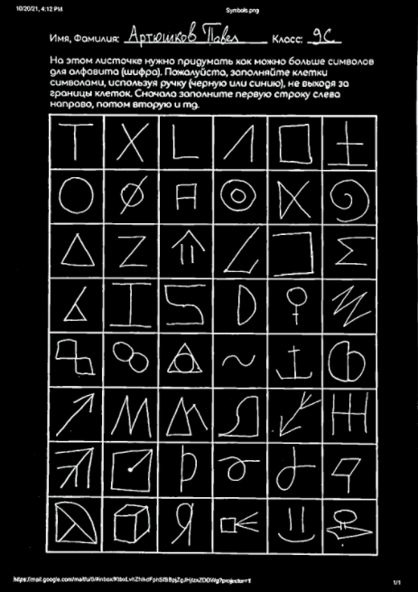
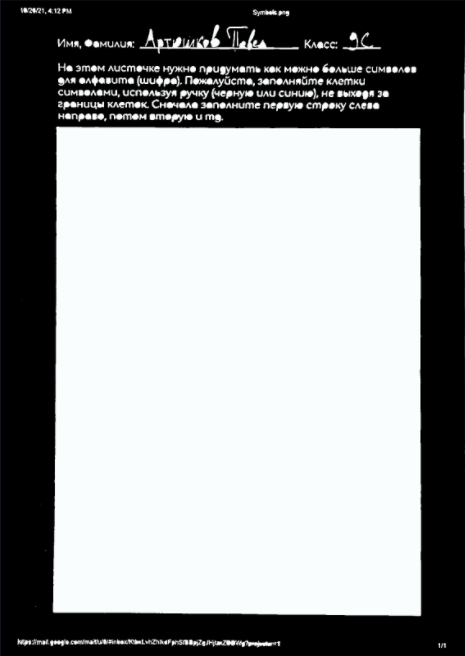
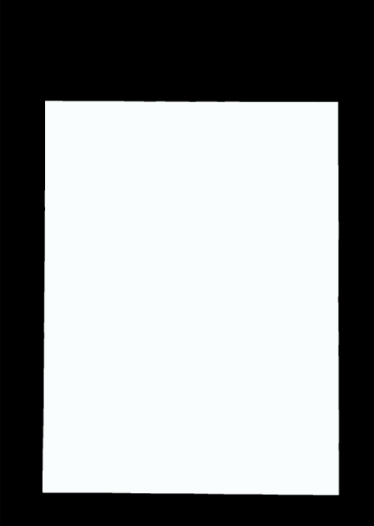
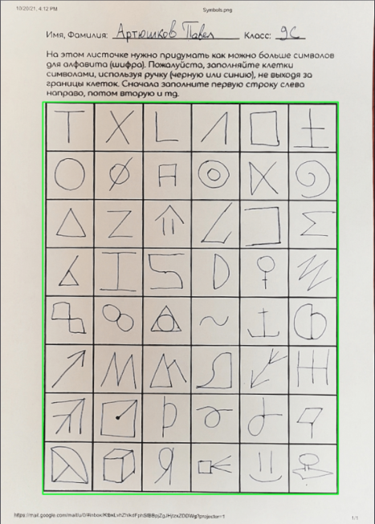
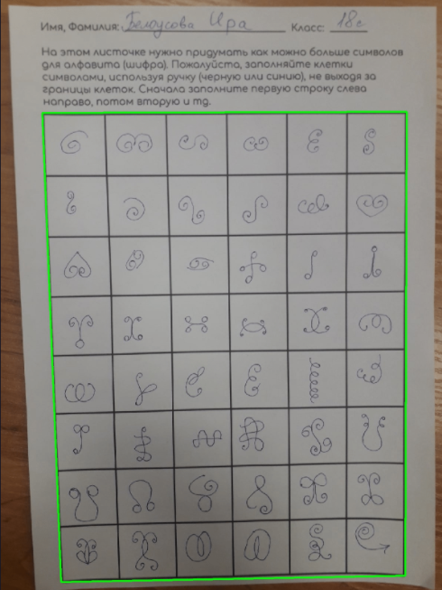
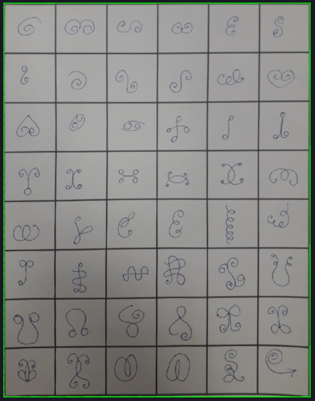
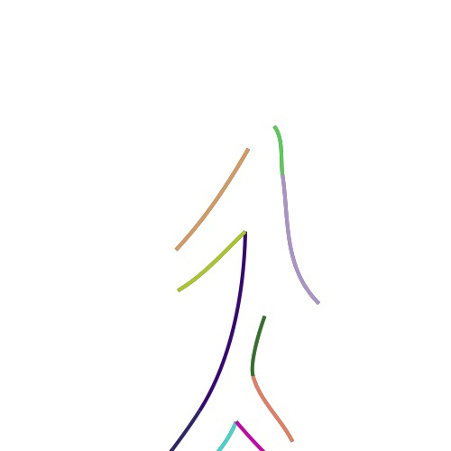
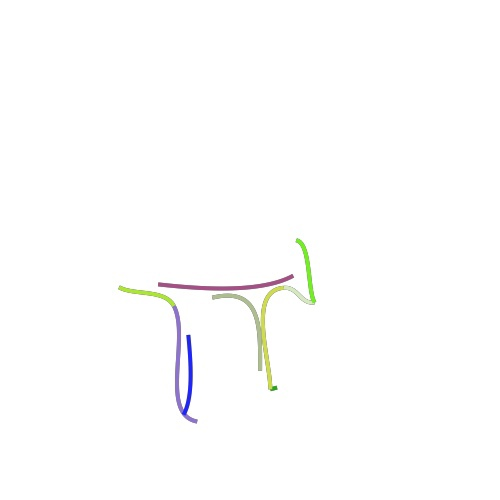
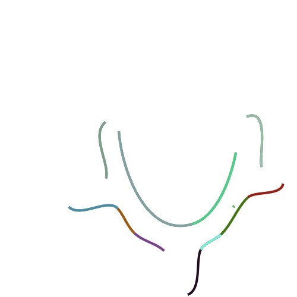

# Symbol-Detective
## The goal
My goal is to create an easy tool for symbol analytics, because currently all works on the topic of language structures and artificial alphabets are done fully manual. In this repository I tried converting each indivudual symbol to graph by counting number of branches from each point. This method came out being not too stable and universal.
So now I'm working on the next idea: using image vectorising techniques I'm converting all symbols to a set of arches, and then count a number of strikes in the symbol.

## Symbol parsing

  
  
  
  

## Found main symbol area

## Warp image if not perfect

  
  

## Symbol processing
Next I needed to split the symbol into a number of strokes.
Let's call stroke a line that contains no sharp bends, therefore can be drawn with one move of a hand.

To do this, I decided to use Scalable Vector Graphics algorithms. I converted all symbols to .svg format and then parsed it.
I got a set of beizer curves describing a symbol.

Then I left only ones, which were not steep. I calculated how **bend** the curve is by
`angle between control segments / curve length`. This is what I've got:

    
    
    

